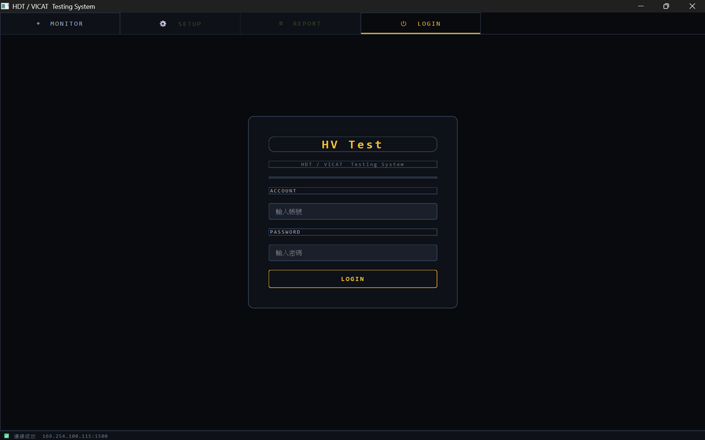
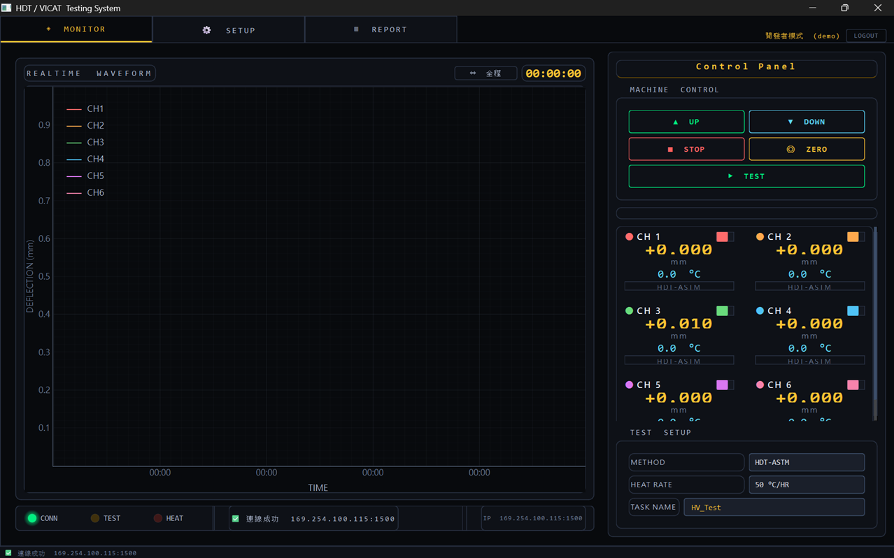
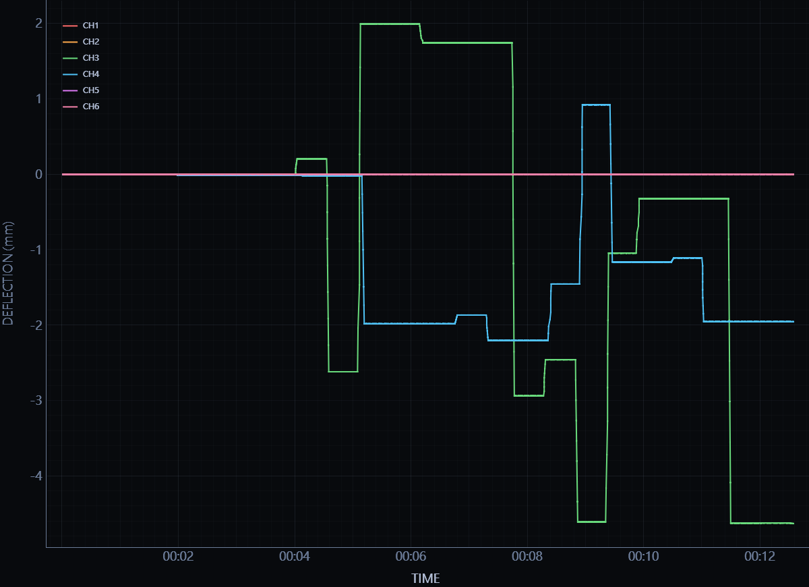
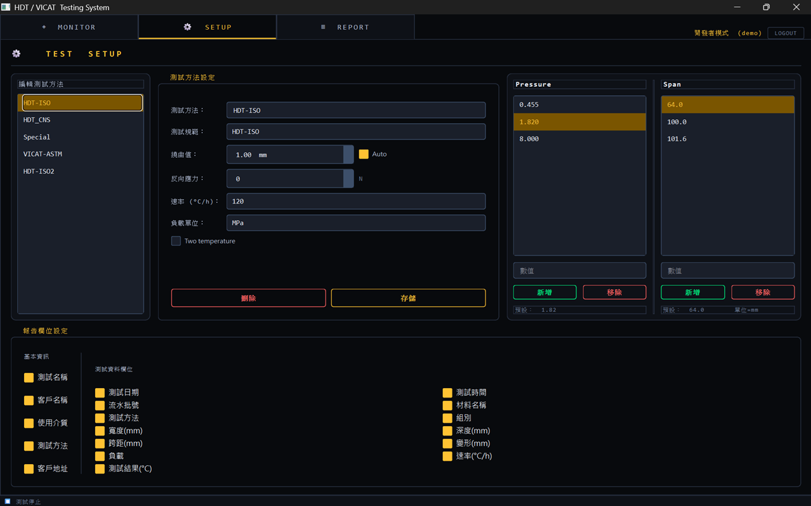
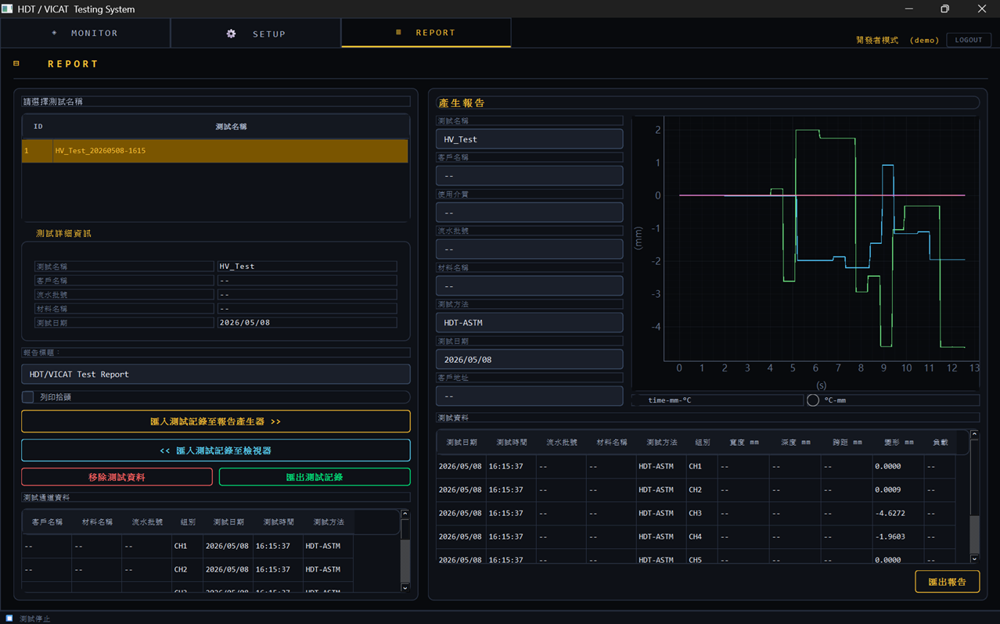

# 🌡️ Thermal Testing GUI

> A desktop monitoring and reporting application for **HDT / Vicat Softening Point** thermal testing machines.  
> Built with **Python + PyQt6**, featuring real-time 6-channel data visualization, test method management, and automated Excel report export.

---

## 📸 Screenshots

### Login Screen
<!-- 請將登入畫面截圖放在 docs/screenshots/ 目錄，並更新下方路徑 -->


---

### Main Monitor Panel
<!-- 主監控畫面截圖 -->


---

### Running a Test
<!-- 執行畫面截圖 -->


---

### Settings Page
<!-- 設定頁面截圖 -->


---

### Report / Export Page
<!-- 輸出頁面截圖 -->


---

### Live Demo (9-second clip)
<!-- 執行測試 GIF，建議放在 docs/ 目錄 -->


---

## ✨ Features

- **6-Channel Real-Time Monitoring** — Live LVDT deflection (mm) and temperature (°C) display for all 6 channels simultaneously
- **Multi-Channel Waveform Chart** — Smooth, scrollable real-time line chart powered by `pyqtgraph`
- **Configurable Test Methods** — Supports HDT-ISO, HDT-CNS, VICAT-ASTM and custom user-defined methods
- **Excel Report Export** — One-click export to `.xlsx` with embedded line charts via `openpyxl`
- **User Authentication** — Login/logout management; unauthenticated users can monitor but not export
- **Simulation Mode** — Full offline testing support without physical hardware connection
- **Long-Run Data Compression** — Custom in-place stride decimation algorithm (`CompressedBuffer`) keeps memory usage flat across hours-long tests, with peak-value preservation

---

## 🗂️ Project Structure

```
Thermal-Testing-GUI/
│
├── main.py                  # Entry point
│
├── core/
│   └── machine.py           # Hardware communication layer (TCP socket, packet parsing)
│
├── gui/
│   ├── main_window.py       # Main window, tab management, auth state
│   ├── login_panel.py       # Login panel (SHA-256 password verification)
│   ├── monitor_panel.py     # Monitor panel — real-time chart, CompressedBuffer, test control
│   ├── setup_panel.py       # Test method configuration
│   └── report_panel.py      # Report generation and Excel export
│
└── models/                  # Data models
```

---

## 🛠️ Tech Stack

| Layer | Technology |
|---|---|
| GUI Framework | [PyQt6](https://pypi.org/project/PyQt6/) |
| Real-Time Chart | [pyqtgraph](https://pyqtgraph.readthedocs.io/) |
| Excel Export | [openpyxl](https://openpyxl.readthedocs.io/) |
| Hardware Comm | TCP Socket (custom binary protocol) |
| Language | Python 3.10+ |
| Platform | Windows 10 / 11 |

---

## 🚀 Getting Started

### Prerequisites

- Python 3.10 or above
- Windows 10 / 11 (recommended)
- Network connection to the testing machine (`192.168.1.100:1500`), **or** use simulation mode

### Installation

**Step 1 — Clone the repository**

```bash
git clone https://github.com/YOUR_USERNAME/Thermal-Testing-GUI.git
cd Thermal-Testing-GUI
```

**Step 2 — Create a virtual environment (recommended)**

```bash
python -m venv venv

# Windows
venv\Scripts\activate

# macOS / Linux
source venv/bin/activate
```

**Step 3 — Install dependencies**

```bash
pip install PyQt6 pyqtgraph openpyxl
```

**Step 4 — Run the application**

```bash
python main.py
```

> **No hardware?** Open `main.py` and set `simulation=True` to run the full GUI in offline simulation mode.

---

## 🧠 Notable Implementation: Long-Run Data Compression

One of the more interesting engineering challenges in this project was handling tests that run for **hours or even days** at 100ms sample intervals.

Naively accumulating data would exhaust memory and crash the chart renderer. Instead, I implemented a custom **in-place stride decimation** algorithm (`CompressedBuffer` in `monitor_panel.py`):

- A fixed-size circular array of `N = 10,000` points per channel is allocated upfront
- When the array fills up, **even-indexed samples are kept and odd-indexed samples are discarded**, freeing the second half for new data
- Each compression round doubles the effective time span while keeping memory constant
- A **peak-value tracking** mechanism ensures that stress peaks and maximum deflection values are never lost during compression, even across multiple compression rounds
- The time axis stores real elapsed seconds (`time.time() - t0`) rather than reconstructed intervals, so the chart remains accurate after any number of compressions

This means the GUI can monitor a 72-hour test just as smoothly as a 5-minute one, with the most recent data always displayed at the highest resolution.

---

## 📋 Changelog

### v1.4 — 2026-05-08
- Documentation: clarified packet header buf index conversion rule (`buf_index = RAM_address + 0x0C`)
- Corrected key offset table; reclassified LVDT offset as expected behavior (not a bug)

### v1.3 — 2026-05-07
- `SaveResultDialog`: screenshot and CSV export no longer auto-close the dialog; both actions can now be performed in a single stop event
- Dark mode contrast improvements across all panels
- Incremental font size increases for better legibility

### v1.0 — 2026-05-07
- Initial release: 6-channel real-time monitoring, waveform recording with compression buffer, test method management, Excel export, login/logout

---

## 📄 License

This project is for **portfolio demonstration purposes**.  
All company-specific and personal identifiers have been removed.

---

*Built by TyL — 2026*
